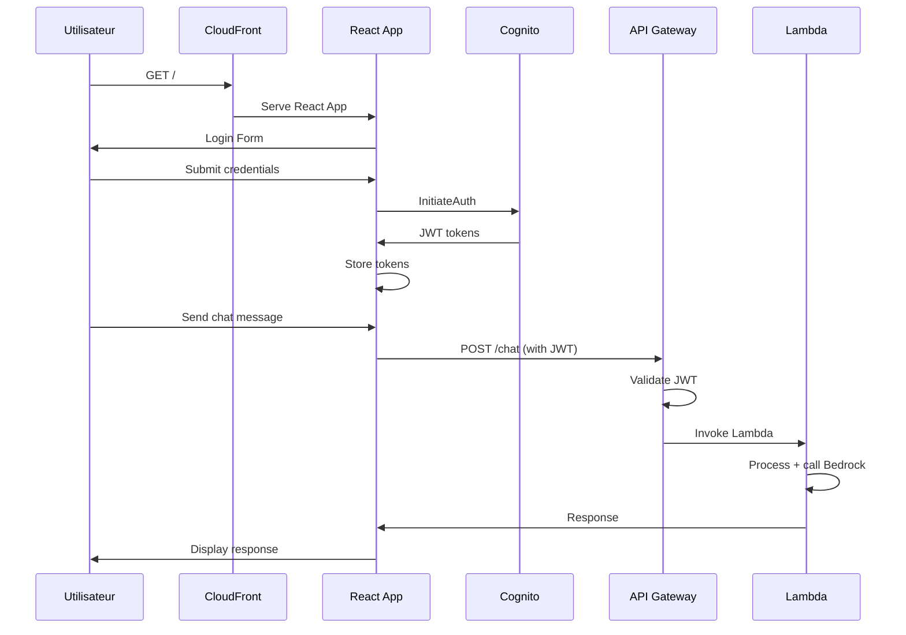

# Architecture - Claude Serverless Chat

## Vue d'ensemble

Cette application utilise une architecture serverless complète sur AWS avec authentification Cognito côté applicatif (Option 1).

## Diagramme d'architecture

```
┌─────────────────┐    ┌──────────────────┐    ┌─────────────────┐
│                 │    │                  │    │                 │
│   Utilisateur   │◄──►│   CloudFront     │◄──►│   S3 Bucket     │
│                 │    │   (CDN)          │    │   (Frontend)    │
└─────────────────┘    └──────────────────┘    └─────────────────┘
         │                        │
         │                        │
         ▼                        ▼
┌─────────────────┐    ┌──────────────────┐
│                 │    │                  │
│   React App     │◄──►│   Cognito        │
│   (Auth + UI)   │    │   User Pool      │
│                 │    │                  │
└─────────────────┘    └──────────────────┘
         │
         │
         ▼
┌─────────────────┐    ┌──────────────────┐    ┌─────────────────┐
│                 │    │                  │    │                 │
│   API Gateway   │◄──►│   Lambda         │◄──►│   DynamoDB      │
│   (REST API)    │    │   Functions      │    │   (Chat/Files)  │
│                 │    │                  │    │                 │
└─────────────────┘    └──────────────────┘    └─────────────────┘
                                │                        │
                                │                        │
                                ▼                        ▼
                       ┌──────────────────┐    ┌─────────────────┐
                       │                  │    │                 │
                       │   AWS Bedrock    │    │   S3 Bucket     │
                       │   (Claude 3.5)   │    │   (Files)       │
                       │                  │    │                 │
                       └──────────────────┘    └─────────────────┘
```

## Composants Principaux

### 1. Frontend (React + Vite)
- **Hébergement** : S3 + CloudFront
- **Framework** : React 18 avec TypeScript
- **Build** : Vite pour des performances optimales
- **Styling** : TailwindCSS pour l'interface
- **Authentification** : SDK Cognito JavaScript

**Fichiers clés :**
- `src/contexts/AuthContext.tsx` - Gestion de l'authentification
- `src/pages/ChatPage.tsx` - Interface principale de chat
- `src/config/aws.ts` - Configuration AWS

### 2. Authentification (AWS Cognito)
- **User Pool** : Gestion des utilisateurs et mots de passe
- **Identity Pool** : Fédération d'identité pour l'accès AWS
- **Flow** : USER_SRP_AUTH pour l'authentification sécurisée
- **Tokens** : JWT stockés côté client (localStorage)

**Sécurité :**
- Validation des tokens côté API Gateway
- Pas d'accès non authentifié aux ressources
- Rotation automatique des tokens

### 3. API Gateway
- **Type** : REST API avec authorizer Cognito
- **Endpoints** :
  - `POST /chat` - Envoi de messages à Claude
  - `POST /files` - Upload et traitement de fichiers
  - `OPTIONS /*` - Support CORS

**CORS Configuration :**
- Headers autorisés pour les tokens Cognito
- Origins configurables (par défaut : *)
- Méthodes : GET, POST, PUT, OPTIONS

### 4. Lambda Functions

#### Chat Handler (`chat-handler`)
- **Runtime** : Node.js 20.x
- **Timeout** : 30 secondes
- **Rôle** : Accès Bedrock + DynamoDB + logs

**Fonctionnalités :**
- Appel à Claude 3.5 Sonnet via Bedrock
- Gestion de l'historique des conversations
- Support des fichiers en contexte
- Sauvegarde en DynamoDB

#### File Processor (`file-processor`)
- **Runtime** : Node.js 20.x  
- **Timeout** : 60 secondes
- **Rôle** : Accès S3 + DynamoDB + logs

**Formats supportés :**
- PDF (pdf-parse)
- DOCX (mammoth)
- CSV (csv-parse)
- TXT, JSON, MD, code source

### 5. Stockage

#### DynamoDB Tables

**Chat History (`chat-history`)** :
```
Primary Key: user_id (String), conversation_id (String)
Attributes:
- messages: [{ role, content, timestamp }]
- timestamp: Number
- ttl: Number (3 mois)

GSI: timestamp-index (user_id, timestamp)
```

**File Metadata (`file-metadata`)** :
```
Primary Key: file_id (String)
Attributes:
- user_id: String
- file_name: String
- file_type: String
- extracted_text: String
- s3_key: String
- upload_timestamp: Number
- ttl: Number (3 mois)

GSI: user-files-index (user_id, upload_timestamp)
```

#### S3 Buckets

**Frontend Bucket** :
- Héberge les fichiers statiques React
- Accès via CloudFront uniquement (OAC)
- Versioning activé

**File Upload Bucket** :
- Stockage des fichiers utilisateur
- Structure : `{user_id}/{file_id}/{filename}`
- CORS configuré pour upload direct
- TTL via lifecycle rules

### 6. AWS Bedrock
- **Modèle** : Claude 3.5 Sonnet (anthropic.claude-3-5-sonnet-20241022-v2:0)
- **Région** : eu-west-1
- **Limites** : 4000 tokens max par réponse
- **Permissions** : InvokeModel via rôle Lambda

## Flow d'Authentification (Option 1)



## Flux de Données

### 1. Envoi d'un message
1. **React** : Utilisateur tape un message
2. **Auth** : Validation du token JWT local
3. **API** : Envoi à API Gateway avec header Authorization
4. **Validation** : API Gateway valide le token Cognito
5. **Lambda** : Traitement du message + contexte fichiers
6. **Bedrock** : Appel à Claude 3.5 Sonnet
7. **Stockage** : Sauvegarde conversation DynamoDB
8. **Réponse** : Retour via API Gateway → React

### 2. Upload de fichier
1. **React** : Sélection fichier par utilisateur
2. **Conversion** : Encodage base64 côté client
3. **API** : Envoi à `/files` avec métadonnées
4. **Lambda** : Extraction texte + upload S3
5. **Stockage** : Métadonnées en DynamoDB
6. **Contexte** : Texte extrait disponible pour chat

## Sécurité

### Network Security
- **HTTPS** : Forcé sur CloudFront
- **CORS** : Configuration restrictive
- **WAF** : Optionnel (non configuré par défaut)

### Authentication & Authorization
- **Cognito** : Gestion centralisée des utilisateurs
- **JWT** : Tokens avec expiration (60 min)
- **API Gateway** : Authorizer Cognito obligatoire
- **IAM** : Rôles Lambda avec permissions minimales

### Data Protection
- **Encryption** : 
  - DynamoDB : Chiffrement au repos
  - S3 : Chiffrement AES-256
  - Bedrock : Chiffrement en transit
- **TTL** : Suppression automatique des données
- **Access Control** : Isolation par user_id

## Monitoring & Observabilité

### CloudWatch Logs
- Lambda Functions : `/aws/lambda/{function-name}`
- API Gateway : Logs d'accès configurables

### Métriques
- **API Gateway** : Latence, erreurs, nombre de requêtes
- **Lambda** : Durée d'exécution, erreurs, invocations
- **DynamoDB** : RCU/WCU, throttling
- **CloudFront** : Cache hit ratio, origine requests

### Alertes Recommandées
- Erreurs Lambda > 5%
- Latence API > 5s
- Throttling DynamoDB
- Coûts Bedrock élevés

## Coûts Estimés (mensuel)

**Usage modéré (100 utilisateurs, 10 messages/jour) :**
- **Lambda** : ~$5-10
- **API Gateway** : ~$3-5
- **DynamoDB** : ~$1-3
- **S3** : ~$1-2
- **CloudFront** : ~$1-2
- **Cognito** : ~$0.50
- **Bedrock** : ~$20-50 (selon usage)

**Total estimé : $30-75/mois**

## Optimisations Possibles

### Performance
- **Lambda Layers** : Réduction cold starts
- **CloudFront Cache** : Optimisation TTL
- **DynamoDB** : Optimisation des index

### Coûts
- **Lambda Provisioned** : Si usage prévisible
- **S3 Lifecycle** : Migration vers IA/Glacier
- **DynamoDB On-Demand** : Adaptation au trafic

### Fonctionnalités
- **WebSocket API** : Chat en temps réel
- **Streaming** : Réponses Claude en streaming
- **Multi-région** : Haute disponibilité